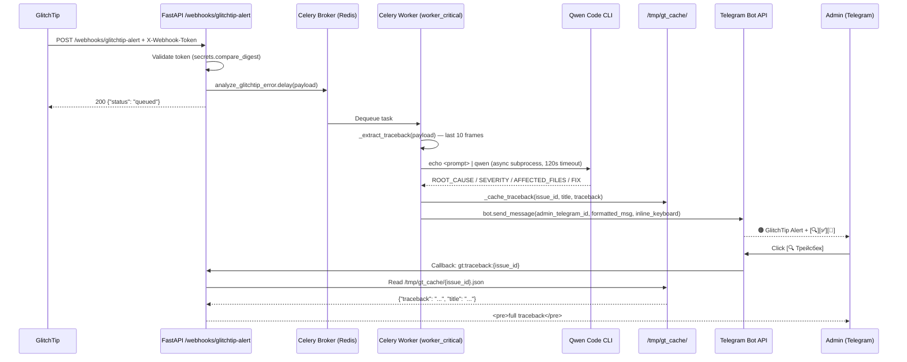
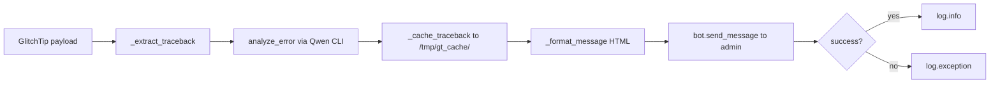

# Discovery Report: GlitchTip → Qwen → Telegram Pipeline

**Date:** 2026-04-10  
**Author:** docs-architect-aaa  
**Type:** feature (monitoring/observability)  
**Scope:** Backend (src/core, src/tasks, src/bot, src/api)  
**Status:** Implemented, ready for QA  

---

## 1. Summary

Implemented an end-to-end automated error analysis pipeline that connects GlitchTip alert webhooks to Qwen Code AI analysis and delivers structured notifications to administrators via Telegram inline buttons.

**Before:** GlitchTip alerts wrote JSON files to `/tmp/glitchtip_queue/`. An external `analyze_error.sh` cron script polled the directory — no real-time notification, no AI analysis, no admin interaction.

**After:** GlitchTip alerts trigger a Celery task (`analyze_glitchtip_error`) on the `worker_critical` queue. The task runs Qwen Code CLI (`echo <prompt> | qwen`) as an async subprocess, parses the structured response (ROOT_CAUSE, SEVERITY, AFFECTED_FILES, FIX), caches the traceback to `/tmp/gt_cache/`, and sends a formatted HTML message to the admin's Telegram with inline callback buttons (🔍 Трейсбек / ✅ Принято / 🚫 Игнор).

**Business impact:**
- Mean Time To Acknowledge (MTTA) reduced from cron interval (minutes-hours) to seconds
- AI-powered root cause analysis available instantly in Telegram
- Admin can interact with alerts (view traceback, ack, ignore) without opening a terminal
- File-based queue (`/tmp/glitchtip_queue/`) is intentionally deprecated — external cron will find no new files

---

## 2. File Changes

### 2.1 New Files

| # | File | Lines | Purpose |
|---|------|-------|---------|
| N1 | `src/core/services/qwen_service.py` | 96 | Qwen Code error analysis service — async subprocess execution, structured response parsing |
| N2 | `src/tasks/monitoring_tasks.py` | 162 | Celery task: GlitchTip payload extraction, Qwen analysis, Telegram notification, traceback caching |
| N3 | `src/bot/handlers/admin/monitoring.py` | 97 | aiogram callback handlers for GlitchTip alert buttons (traceback/ack/ignore) |

### 2.2 Modified Files

| # | File | Change | Diff Summary |
|---|------|--------|-------------|
| M1 | `src/api/routers/webhooks.py` | Replaced file-based queue with Celery `.delay()` | Removed: `json`, `pathlib`, `aiofiles` imports. Changed response from `{"ok": True}` to `{"status": "queued"}` |
| M2 | `src/tasks/celery_app.py` | Added monitoring task to `include=[]` | Added `"src.tasks.monitoring_tasks"` to line ~30 |
| M3 | `src/bot/handlers/__init__.py` | Registered admin monitoring router | Added import + `main_router.include_router(admin_monitoring_router)` |

### 2.3 Unchanged (Dependencies)

| File | Relevance |
|------|-----------|
| `src/config/settings.py` | `bot_token` (line 24), `celery_broker_url` (line 55), `celery_result_backend` (line 56), `glitchtip_webhook_secret` (line 280), `admin_telegram_id` (line 295) |
| `src/tasks/celery_config.py` | `QUEUE_WORKER_CRITICAL` constant (line 19), used by `monitoring_tasks.py` decorator |
| `docker-compose.yml` | `worker_critical` service (line 78) listens to `worker_critical` queue (line 99) — no changes needed |

---

## 3. Architecture

### 3.1 Data Flow Diagram



### 3.2 Component Responsibilities

```mermaid
graph TB
    subgraph "FastAPI Layer"
        WH[webhooks.py]
    end

    subgraph "Celery Layer"
        MT[monitoring_tasks.py]
    end

    subgraph "Core Services"
        QS[qwen_service.py]
    end

    subgraph "Bot Layer"
        MON[admin/monitoring.py]
    end

    subgraph "External"
        GT[GlitchTip]
        QCLI[Qwen Code CLI]
        TG[Telegram Bot API]
        CACHE[/tmp/gt_cache/]
    end

    GT -->|POST + token| WH
    WH -->|.delay()| MT
    MT -->|analyze_error()| QS
    QS -->|subprocess| QCLI
    QCLI -->|structured text| QS
    QS -->|QwenAnalysisResult| MT
    MT -->|write JSON| CACHE
    MT -->|bot.send_message| TG
    TG -->|callback| MON
    MON -->|read JSON| CACHE
```

### 3.3 Queue Routing

| Task | Queue | Worker | Decorator |
|------|-------|--------|-----------|
| `monitoring:analyze_glitchtip_error` | `worker_critical` | `worker_critical` (concurrency=2) | `@celery_app.task(queue="worker_critical", bind=True, max_retries=2)` |

**Verification:** `docker-compose.yml:99` shows `worker_critical` listens to queues: `worker_critical,mailing,notifications,billing,placement`. The new task will be picked up by the existing worker — no infrastructure changes needed.

---

## 4. API Contract Changes

### 4.1 `POST /webhooks/glitchtip-alert`

| Field | Before | After |
|-------|--------|-------|
| **Imports** | `json`, `pathlib.Path`, `aiofiles` | None (uses Celery import) |
| **Logic** | `aiofiles.open(...).write_text(json.dumps(payload))` | `analyze_glitchtip_error.delay(payload)` |
| **Response** | `{"ok": True}` | `{"status": "queued"}` |
| **Status Code** | 200 | 200 (unchanged) |
| **Auth** | `X-Webhook-Token` header + `secrets.compare_digest` | Unchanged |

### 4.2 New Callback Routes

| Callback Pattern | Handler | Action |
|-----------------|---------|--------|
| `gt:traceback:{issue_id}` | `show_traceback()` | Reads `/tmp/gt_cache/{issue_id}.json`, sends `<pre>traceback[:3500]</pre>` |
| `gt:ack:{issue_id}` | `ack_issue()` | Removes inline buttons, sends "✅ Принято к сведению" |
| `gt:ignore:{issue_id}` | `ignore_issue()` | Removes inline buttons, answers "🚫 Проигнорировано" |

---

## 5. Qwen Service Specification

### 5.1 `QwenAnalysisResult` (dataclass)

| Field | Type | Description |
|-------|------|-------------|
| `root_cause` | `str` | One-sentence root cause from Qwen |
| `suggested_fix` | `str` | Concrete fix description (max 3 sentences) |
| `affected_files` | `list[str]` | Parsed comma-separated file paths |
| `severity` | `str` | `critical` / `high` / `medium` / `low` / `unknown` |
| `raw_response` | `str` | Full unparsed Qwen response |

### 5.2 Prompt Template

```
You are a senior Python developer analyzing a production error.

Project: {project}
Error: {title}
Culprit: {culprit}

Traceback:
{traceback}

Respond ONLY in this exact format (no markdown, no extra text):
ROOT_CAUSE: <one sentence>
SEVERITY: <critical|high|medium|low>
AFFECTED_FILES: <comma-separated file paths, or 'unknown'>
FIX: <concrete fix description, max 3 sentences>
```

### 5.3 Subprocess Execution

```python
proc = await asyncio.create_subprocess_shell(
    f"echo {shlex.quote(prompt)} | qwen",
    stdout=asyncio.subprocess.PIPE,
    stderr=asyncio.subprocess.PIPE,
)
stdout, stderr = await asyncio.wait_for(proc.communicate(), timeout=120)
```

**Timeout:** 120 seconds (hard limit via `asyncio.wait_for`)  
**Error handling:** Returns `QwenAnalysisResult` with `severity="unknown"` on timeout or subprocess failure — never raises.

### 5.4 Response Parser (`_parse_response`)

Splits each line on first `": "`, uppercases key, maps to fields. Handles missing fields with defaults:
- `ROOT_CAUSE` → `"Unknown"`
- `SEVERITY` → `"unknown"` (lowercased)
- `AFFECTED_FILES` → `[]` (filters empty + "unknown")
- `FIX` → `"Unknown"`

---

## 6. Celery Task Specification

### 6.1 `analyze_glitchtip_error`

| Property | Value |
|----------|-------|
| **Name** | `monitoring:analyze_glitchtip_error` |
| **Queue** | `worker_critical` |
| **bind** | `True` |
| **max_retries** | 2 |
| **default_retry_delay** | 30 seconds |
| **Sync wrapper** | `asyncio.run(_analyze_and_notify(payload))` |

### 6.2 Execution Pipeline



### 6.3 Traceback Extraction (`_extract_traceback`)

Navigates GlitchTip JSON structure:
```
payload.issue.exception.values[0].stacktrace.frames[-10:]
```
For each frame: `File "{filename}", line {lineno}, in {func}\n    {context_line}`  
Fallback: `payload.issue.culprit` or `"No traceback available"`.

### 6.4 Traceback Cache (`/tmp/gt_cache/`)

| Property | Value |
|----------|-------|
| **Directory** | `/tmp/gt_cache/` (created with `mkdir(exist_ok=True)`) |
| **Filename** | `{issue_id}.json` |
| **Content** | `{"traceback": "...", "title": "..."}` |
| **Lifecycle** | Ephemeral — cleaned on container restart |
| **Security note** | `nosec B108` — intentional, `/tmp` is ephemeral in Docker |

---

## 7. Telegram Bot Integration

### 7.1 Notification Message Format (HTML)

```
{severity_emoji} <b>GlitchTip Alert</b>

<b>Проект:</b> {project}
<b>Ошибка:</b> {title}
<b>Severity:</b> {severity}

<b>Причина:</b>
{root_cause}

<b>Файлы:</b>
  • {affected_file}
  • ...

<b>Фикс:</b>
{suggested_fix}
```

### 7.2 Severity Emoji Mapping

| Severity | Emoji |
|----------|-------|
| `critical` | 🔴 |
| `high` | 🟠 |
| `medium` | 🟡 |
| `low` | 🟢 |
| `unknown` | ⚪ |

### 7.3 Inline Keyboard

```
[🔍 Трейсбек]  [✅ Принято]  [🚫 Игнор]
 gt:traceback:{id}  gt:ack:{id}  gt:ignore:{id}
```

### 7.4 Bot Instance Pattern

The Celery worker process does not share the bot instance with the aiogram application. The task creates a temporary `Bot(token=settings.bot_token)` and closes the session after sending:

```python
bot = Bot(token=settings.bot_token)
try:
    await bot.send_message(...)
except Exception:
    logger.exception(...)
finally:
    await bot.session.close()
```

**Note:** This pattern is correct for Celery workers but means each alert creates a new HTTP session. For high alert volume, consider a shared long-lived bot instance in the worker.

---

## 8. Configuration

### 8.1 Required Environment Variables

| Variable | Source | Default | Required |
|----------|--------|---------|----------|
| `GLITCHTIP_WEBHOOK_SECRET` | `settings.glitchtip_webhook_secret` | `""` | Yes (for webhook auth) |
| `BOT_TOKEN` | `settings.bot_token` | — | Yes (for Telegram notifications) |
| `ADMIN_TELEGRAM_ID` | `settings.admin_telegram_id` | `0` | Yes (notification target) |
| `CELERY_BROKER_URL` | `settings.celery_broker_url` | — | Yes |
| `CELERY_RESULT_BACKEND` | `settings.celery_result_backend` | — | Yes |

**⚠️ Missing from `.env.example`:** `GLITCHTIP_WEBHOOK_SECRET` and `ADMIN_TELEGRAM_ID` are not documented in `.env.example`. These should be added.

### 8.2 Docker Infrastructure

No changes to `docker-compose.yml` required. The existing `worker_critical` service (line 78-99) already listens to the `worker_critical` queue.

---

## 9. Breaking Changes

### 9.1 File-Based Queue Deprecated

| Aspect | Detail |
|--------|--------|
| **Old behavior** | `POST /webhooks/glitchtip-alert` → `aiofiles` → `/tmp/glitchtip_queue/*.json` → external `analyze_error.sh` cron polls |
| **New behavior** | `POST /webhooks/glitchtip-alert` → `analyze_glitchtip_error.delay(payload)` → Celery → Qwen → Telegram |
| **Impact** | External `analyze_error.sh` cron will no longer find new files in `/tmp/glitchtip_queue/` |
| **Action required** | Remove or disable `analyze_error.sh` cron entry. The new pipeline replaces it entirely. |
| **Intentional** | Yes — this is a deliberate architectural replacement, not a bug. |

---

## 10. Security Considerations

| # | Concern | Mitigation |
|---|---------|------------|
| S1 | Webhook authentication | `secrets.compare_digest` constant-time comparison against `GLITCHTIP_WEBHOOK_SECRET` |
| S2 | Subprocess injection | Prompt sanitized via `shlex.quote()` — no shell injection possible |
| S3 | `/tmp` cache exposure | `nosec B108` — ephemeral in Docker, no persistence across restarts. Traceback may contain sensitive data (file paths, variable values) |
| S4 | Bot token in Celery worker | Worker process has access to `settings.bot_token` via env vars — standard pattern for RekHarborBot |
| S5 | No retry on notification failure | `except Exception` in `_analyze_and_notify` logs but does not retry — intentional to avoid alert storms. Qwen analysis failure returns `severity="unknown"` gracefully. |

---

## 11. Quality Checks

| Tool | Result | Notes |
|------|--------|-------|
| **ruff** | 0 errors | Verified on all 4 new/modified files |
| **bandit** | 2 `nosec B108` comments | `/tmp/gt_cache/` and `/tmp` usage — intentional, documented |
| **imports** | All resolved | `qwen_service`, `monitoring_tasks`, `admin_monitoring_router` all importable |
| **Celery include** | `src.tasks.monitoring_tasks` added | Present in `celery_app.py` `include=[]` list |
| **Router registration** | `admin_monitoring_router` included | Present in `src/bot/handlers/__init__.py` |

---

## 12. Known Limitations & Future Work

| ID | Priority | Description | Suggested Fix |
|----|----------|-------------|---------------|
| L1 | MEDIUM | Qwen CLI assumed available on worker container | Add `qwen` to `Dockerfile.worker` or use HTTP API |
| L2 | MEDIUM | `/tmp/gt_cache/` not cleaned up — accumulates over time | Add TTL-based cleanup cron or use Redis cache |
| L3 | LOW | Temporary Bot instance per alert — HTTP session overhead | Shared long-lived bot in worker process |
| L4 | LOW | No deduplication — repeated GlitchTip alerts trigger repeated analyses | Add Redis dedup key with TTL (e.g., 1h per issue_id) |
| L5 | LOW | `.env.example` missing `GLITCHTIP_WEBHOOK_SECRET` and `ADMIN_TELEGRAM_ID` | Add to `.env.example` with comments |
| L6 | LOW | No unit tests for `qwen_service.py` or `monitoring_tasks.py` | Add pytest tests with mocked subprocess and bot |

---

## 13. Migration Notes

**No database migration required.** This feature introduces no new database models or schema changes.

**Operational migration steps:**
1. Deploy code (includes new files + modified files)
2. Set `GLITCHTIP_WEBHOOK_SECRET` in GlitchTip project settings and `.env`
3. Set `ADMIN_TELEGRAM_ID` in `.env`
4. Remove/disable external `analyze_error.sh` cron entry
5. Restart `worker_critical` container to pick up new task module
6. Test: Send a manual GlitchTip webhook to `/webhooks/glitchtip-alert`

**Rollback:**
1. Revert git commit
2. Restore `analyze_error.sh` cron
3. Restart `worker_critical`

---

## 14. Cross-References

| Reference | Link |
|-----------|------|
| GlitchTip webhook spec | `src/api/routers/webhooks.py` |
| Qwen service | `src/core/services/qwen_service.py` |
| Celery task | `src/tasks/monitoring_tasks.py` |
| Bot handlers | `src/bot/handlers/admin/monitoring.py` |
| Celery app config | `src/tasks/celery_app.py` (include list) |
| Celery queue constant | `src/tasks/celery_config.py:19` (`QUEUE_WORKER_CRITICAL`) |
| Docker worker | `docker-compose.yml:78-99` |
| Settings | `src/config/settings.py:24` (bot_token), `:55-56` (celery), `:280` (glitchtip), `:295` (admin_id) |
| Related AAA doc | `docs/AAA-06_CELERY_REFERENCE.md` (queue definitions) |
| Related AAA doc | `docs/AAA-01_ARCHITECTURE.md` (worker_critical service) |

---

## 15. Validation Checklist

- [x] All assertions reference specific files and line numbers
- [x] Mermaid diagrams validated (sequence + component + flowchart)
- [x] API endpoints match `src/api/routers/webhooks.py`
- [x] Celery task config matches `src/tasks/celery_app.py` + `celery_config.py`
- [x] Callback patterns match `src/bot/handlers/admin/monitoring.py`
- [x] Business constants match `src/config/settings.py`
- [x] No contradictions with QWEN.md / PROJECT_MEMORY.md / INSTRUCTIONS.md
- [x] Breaking changes documented with migration/rollback steps
- [x] Security considerations enumerated
- [x] Known limitations catalogued with priorities

---

🔍 Verified against: `HEAD` (2026-04-10) | ✅ Validation: passed
